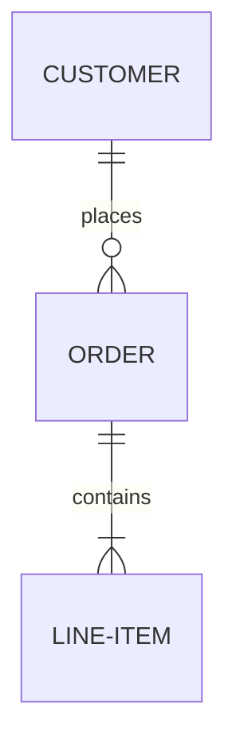
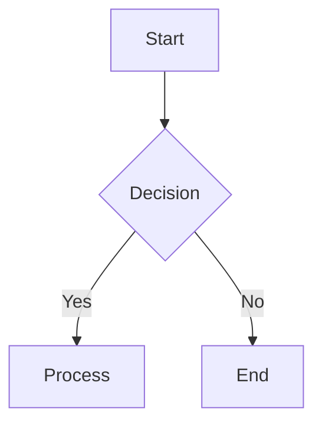
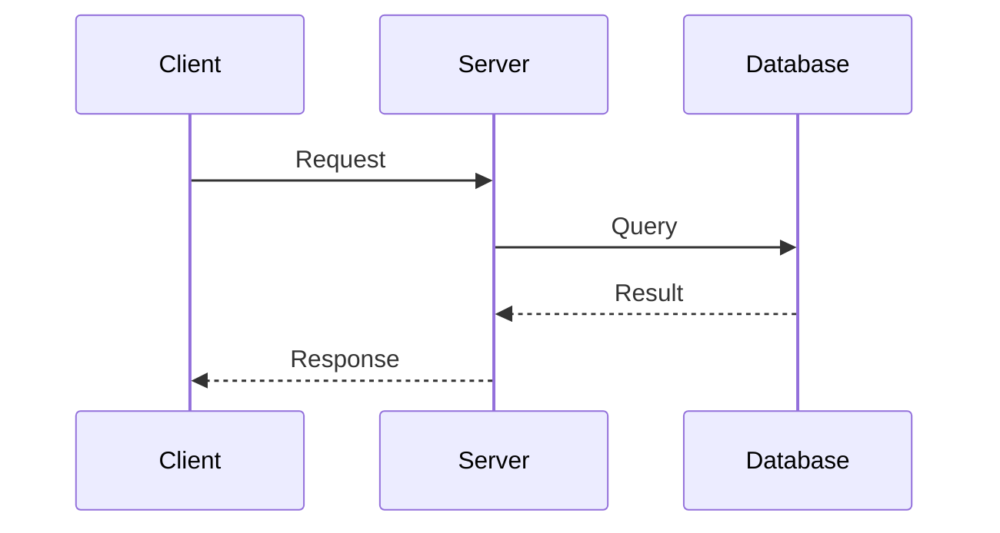
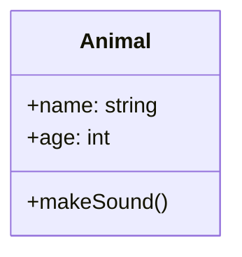

## Context

- The user wants to visualize code structure, data models, or process flows.
- The user has provided source files (SQL, code, docs) or a description of the system.

## Your task

Generate a Mermaid diagram to visualize the provided information.

## Process

1.  Analyze source files (SQL, code, docs) or the user''s description.
2.  Extract entities, relationships, and flows.
3.  Generate the appropriate diagram type (e.g., Entity Relationship, Flow Chart, Sequence, Class).
4.  Include relevant properties and methods in the diagram.
5.  Validate the Mermaid syntax.
6.  Save the diagram to a specified location or display it to the user.

## Examples

### Entity Relationship Diagram

### Flow Chart

### Sequence Diagram

### Class Diagram

## Notes

-   **Validation**: Run `npx -p @mermaid-js/mermaid-cli mmdc -i <input>.md -o test.md` to validate.
-   Keep diagrams focused and readable.
-   Use consistent naming conventions.
-   Group related entities.
-   Add labels to relationships and include cardinality where relevant.
-   Use subgraphs for organization and styling for clarity.
