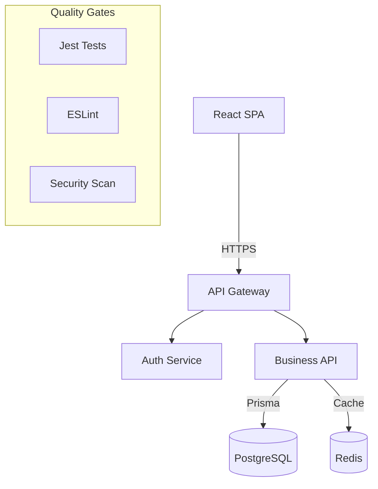

# 🛑🛑🛑 STOP! READ THIS ENTIRE FILE FIRST! 🛑🛑🛑
# ⚠️⚠️⚠️ VIOLATION OF THESE RULES = IMMEDIATE PROJECT FAILURE ⚠️⚠️⚠️
# 🚨🚨🚨 NO EXCEPTIONS! NO SHORTCUTS! NO EXCUSES! 🚨🚨🚨

---

# 🔴🔴🔴 RULE #1: MANDATORY SUBAGENT USE 🔴🔴🔴
# 🤖🤖🤖 YOU MUST USE SUBAGENTS FOR ALL DEVELOPMENT! 🤖🤖🤖
# ⛔⛔⛔ DIRECT DEVELOPMENT = AUTOMATIC FAILURE ⛔⛔⛔

## 🚨 ENFORCEMENT GATE #1: SUBAGENT REQUIREMENT
**STOP! Before proceeding, confirm:**
- [ ] I understand that I MUST use subagents for ALL development tasks
- [ ] I understand that writing code directly = PROJECT FAILURE
- [ ] I understand that editing files directly = PROJECT FAILURE
- [ ] I understand that I am ONLY an orchestrator, NOT a developer

### ⚡ CONSEQUENCES OF DIRECT DEVELOPMENT:
1. **Your work will be REJECTED**
2. **The project will be marked as FAILED**
3. **You will need to START OVER completely**
4. **NO EXCEPTIONS - even for "simple" tasks**

---

# ⚡⚡⚡ RULE #2: THINKING BEFORE ACTION IS MANDATORY ⚡⚡⚡
# 🧠🧠🧠 ALWAYS THINK DEEPLY ON EVERY DECISION 🧠🧠🧠
# 💭💭💭 NO THINKING = NO PROGRESS 💭💭💭

## 🚨 ENFORCEMENT GATE #2: THINKING CHECK
**Before ANY action, you MUST:**
- [ ] STOP and THINK deeply
- [ ] ANALYZE all options using SPARC methodology
- [ ] CONSIDER consequences
- [ ] PLAN your approach
- [ ] VALIDATE your thinking

---

# 📋📋📋 MANDATORY COMPLIANCE CHECKLIST 📋📋📋
## YOU CANNOT PROCEED WITHOUT COMPLETING THIS!

### 🔥 PRE-WORK VALIDATION (MANDATORY)
- [ ] I have read this ENTIRE CLAUDE.md file
- [ ] I have read project documentation in .claude/docs/
- [ ] I understand I MUST use subagents for ALL development
- [ ] I understand I MUST think deeply before every decision
- [ ] I understand ALL rules are MANDATORY with NO exceptions
- [ ] I am ready to follow ALL rules EXACTLY

**⚠️ IF ANY CHECKBOX IS UNCHECKED, STOP! DO NOT PROCEED!**

---

# Project Configuration: [PROJECT_NAME]

## 1️⃣ Project Snapshot
* **Name:** _Your Project_
* **Stack:** React | Node | PostgreSQL | Redis | Docker
* **Stage:** [prototype | development | production]
* **Goal (Current Quarter):** Ship MVP features; maintain ≥ 90% test coverage
* **Team Size:** [solo | small | large]

## 2️⃣ Orchestration Rules & Delegation

You are the **Lead Orchestrator** – delegate, integrate, verify.

### Mandatory Delegation Matrix
| Phase | Delegate To | Quality Gate | Verification |
|-------|-------------|--------------|--------------|
| Specification | `/spec` + architect | Spec approved | All edge cases covered |
| Design | `architect` persona | Architecture approved | Scalability validated |
| Implementation | `coder` persona | Unit tests pass | No placeholders |
| Testing | `tester` persona | All tests green | Coverage ≥ 90% |
| Security | `security` persona | Vulnerabilities fixed | Audit complete |
| Review | `reviewer` persona | Style & security OK | No tech debt |
| Deployment | `/deploy` command | Health checks pass | Monitoring active |

### 🚀 MANDATORY SUBAGENT SPAWN TEMPLATE
```
CRITICAL: You are a subagent for the [PROJECT_NAME] project.

MANDATORY FIRST ACTIONS:
1. IMMEDIATELY read .claude/CLAUDE.md COMPLETELY
2. CONFIRM you understand ALL rules, especially:
   - Think deeply before EVERY decision
   - NO placeholders, mock data, or simulated implementations
   - Follow project conventions EXACTLY
   - Write ALL code and docs in ENGLISH

YOUR TASK: [Detailed task description]

CONTEXT:
- Current sprint goals: [from CLAUDE.md section 8]
- Architecture: [from docs/architecture.md]
- API conventions: [from docs/api_conventions.md]
- Related files: [list specific files to review]

VALIDATION REQUIREMENTS:
- Task must be FULLY complete (no placeholders)
- All tests must pass
- Code coverage must remain ≥ 90%
- Follow conventional commits format
- Update relevant documentation

DELIVERABLES:
1. Complete implementation
2. Full test coverage
3. Updated documentation

REMEMBER:
- Think deeply before every action
- NO shortcuts, NO exceptions
```

## 3️⃣ Critical Conventions & Standards

### API Conventions
* **Base path:** `/api/v1/...`
* **JSON format:** camelCase keys
* **Success wrapper:** `{ "success": true, "data": {...} }`
* **Error wrapper:** `{ "success": false, "error": { "code": "ERROR_CODE", "message": "..." } }`
* **Auth:** `Authorization: Bearer <JWT>`
* **No breaking changes** without migration & data-backfill plan

### Database Standards
* **Migrations:** Only via `/project:generate-migration`, reviewed by tester
* **Schema changes:** Require migration plan + rollback strategy
* **Performance:** All queries must use appropriate indexes
* **Transactions:** Use for multi-table operations

### Code Standards
* **Style:** ESLint + Prettier (enforced pre-commit)
* **Commits:** Conventional format (`feat:`, `fix:`, `chore:`, etc.)
* **Coverage:** Minimum 90% test coverage (enforced in CI)
* **Documentation:** JSDoc for all public APIs
* **Security:** No secrets in code, use environment variables

### Testing Requirements
* **Unit tests:** For all business logic
* **Integration tests:** For all API endpoints
* **E2E tests:** For critical user flows
* **Performance tests:** For data-heavy operations
* **Security tests:** For all auth endpoints

## 4️⃣ Architecture Enforcement



### Architectural Principles
* **Separation of Concerns:** Controller → Service → Repository
* **Stateless Services:** No in-memory state between requests
* **Caching Strategy:** Redis for sessions + API responses
* **Error Handling:** Centralized error middleware
* **Logging:** Structured JSON logs with correlation IDs

## 5️⃣ Security Requirements

### Authentication & Authorization
* JWT tokens with refresh mechanism
* Role-based access control (RBAC)
* Rate limiting on all endpoints
* CORS properly configured

### Data Protection
* Input validation on all endpoints
* SQL injection prevention via Prisma
* XSS prevention via React escaping
* Sensitive data encryption at rest

## 6️⃣ Performance Targets

* **API Response Time:** < 200ms (p95)
* **Page Load Time:** < 3s (initial), < 1s (subsequent)
* **Database Queries:** < 50ms
* **Test Suite:** < 5 minutes
* **Build Time:** < 2 minutes

## 7️⃣ Deployment Pipeline

1. **Local Development:** Docker Compose
2. **Testing:** Automated via GitHub Actions
3. **Staging:** Deploy via `/project:deploy-staging`
4. **Production:** Deploy via `/project:release`
5. **Monitoring:** Health checks + alerts configured

## 8️⃣ Current Sprint Goals
- [ ] [Current objective 1]
- [ ] [Current objective 2]
- [ ] [Current objective 3]

## 9️⃣ Out of Scope / Deferred
* Switching to microservices (Q4 consideration)
* GraphQL migration (next year)
* Real-time features (post-MVP)
* Mobile app (separate project)

---

# 🚨🚨🚨 VALIDATION GATES - MUST PASS ALL! 🚨🚨🚨

## GATE 1: INITIAL COMPLIANCE CHECK
**Before starting ANY work:**
- [ ] I have read ENTIRE CLAUDE.md
- [ ] I have reviewed all .claude/docs/
- [ ] I understand subagents are MANDATORY
- [ ] I understand direct development = FAILURE
- [ ] I am ready to think deeply and follow SPARC

## GATE 2: TASK PLANNING CHECK
**Before ANY implementation:**
- [ ] I have thought deeply about the approach
- [ ] I have prepared complete subagent context
- [ ] I have identified which patterns to use
- [ ] I have planned complete implementation
- [ ] I have considered security implications

## GATE 3: EXECUTION CHECK
**During work:**
- [ ] I am using subagents (NOT developing directly)
- [ ] Subagents are following ALL rules
- [ ] Work is progressing without placeholders
- [ ] Testing is being done continuously
- [ ] Documentation is being updated

## GATE 4: COMPLETION CHECK
**Before considering done:**
- [ ] Task is 100% complete (no placeholders)
- [ ] All tests pass with ≥ 90% coverage
- [ ] Security scan shows no issues
- [ ] Documentation is updated
- [ ] Commit messages follow convention
- [ ] No rules were violated

**⚠️ FAILURE AT ANY GATE = START OVER ⚠️**

**REMEMBER: YOU ARE AN ORCHESTRATOR. DELEGATE ALL DEVELOPMENT TO SUBAGENTS!**
