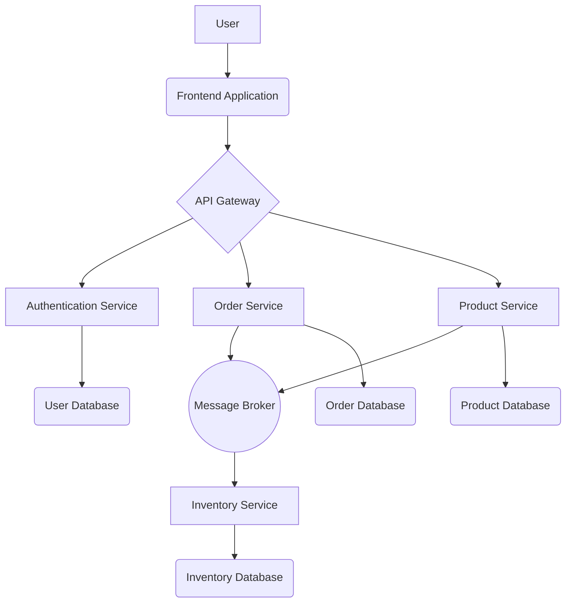

# System Architecture

## Overview
[Provide a high-level, technology-agnostic description of the system's purpose and core components. For example: "This system is a distributed, event-driven platform for processing real-time data streams."]

## Architecture Diagram
[Use a tool like Mermaid or draw.io to create a C4-style diagram (Context, Containers, Components). This keeps the diagram clear and technology-agnostic.]

**Example (Mermaid):**

## Component Breakdown

### [Component 1: e.g., Frontend]
- **Purpose**: [Describe its responsibility, e.g., "Provides the user interface for interacting with the system."]
- **Key Responsibilities**:
    - [Responsibility 1, e.g., User authentication and session management.]
    - [Responsibility 2, e.g., Displaying product information.]
- **Interfaces**: [How it communicates with other components, e.g., "Communicates with the Backend API via RESTful HTTP requests."]

### [Component 2: e.g., Backend API]
- **Purpose**: [e.g., "Exposes business logic and data to client applications."]
- **Architecture Pattern**: [e.g., "Follows a layered architecture (Controller -> Service -> Repository)."]
- **Key Responsibilities**:
    - [Responsibility 1, e.g., "Validating and processing incoming requests."]
    - [Responsibility 2, e.g., "Orchestrating calls to downstream services."]
- **Interfaces**: [e.g., "Exposes a versioned REST API."]

### [Component 3: e.g., Database]
- **Purpose**: [e.g., "Provides persistent storage for application data."]
- **Schema Management**: [e.g., "Migrations are managed through [tool name or process]."]
- **Backup Strategy**: [e.g., "Automated daily backups with point-in-time recovery."]

### [Component 4: e.g., Cache]
- **Purpose**: [e.g., "Improves performance by caching frequently accessed data."]
- **TTL Strategy**: [e.g., "Default TTL of 5 minutes for API responses, 24 hours for user sessions."]
- **Eviction Policy**: [e.g., "Least Recently Used (LRU)."]

## Data Flow
[Describe a typical data flow through the system for a key use case.]
1. A user initiates an action via the **Frontend**.
2. The **Frontend** sends a request to the **Backend API**.
3. The **API** validates the request and authenticates the user.
4. The **API** retrieves or modifies data in the **Database**.
5. The **API** may publish an event to a **Message Broker** for asynchronous processing.
6. The response is returned to the **Frontend**.

## Security Considerations
- **Authentication**: [e.g., "All endpoints require a valid JWT, except for public routes."]
- **Authorization**: [e.g., "Role-based access control (RBAC) is enforced at the API gateway."]
- **Data Protection**: [e.g., "All sensitive data is encrypted at rest and in transit."]
- **Input Validation**: [e.g., "Strict input validation is performed at the service boundary."]

## Scaling Strategy
- **Frontend**: [e.g., "Distributed via a Content Delivery Network (CDN)."]
- **Backend Services**: [e.g., "Services are containerized and can be scaled horizontally behind a load balancer."]
- **Database**: [e.g., "Utilizes read replicas to handle high read traffic."]
- **Cache**: [e.g., "A distributed cache is used for high availability."]
